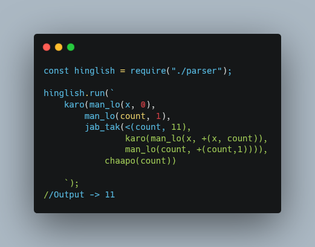

# hinglish
an interpreter written for custom programming language `hinglish` in javascript.

The following image shows how a loop, variable initialization and basic mathematical operations work in `hinglish`. The code shown below outputs 11.

